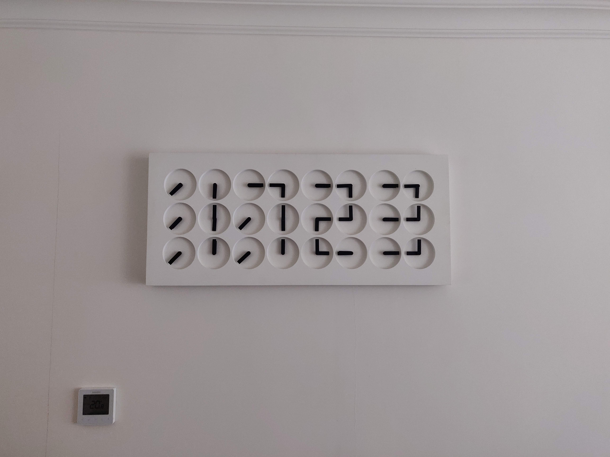
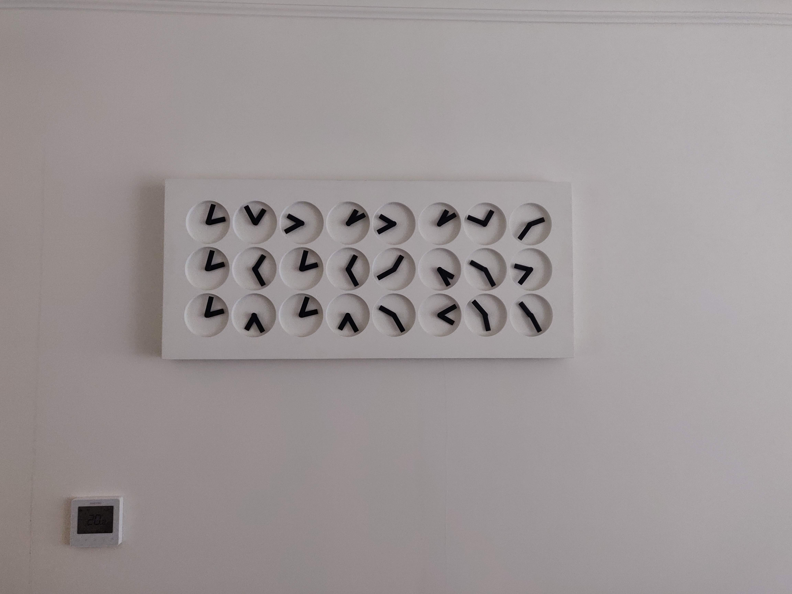
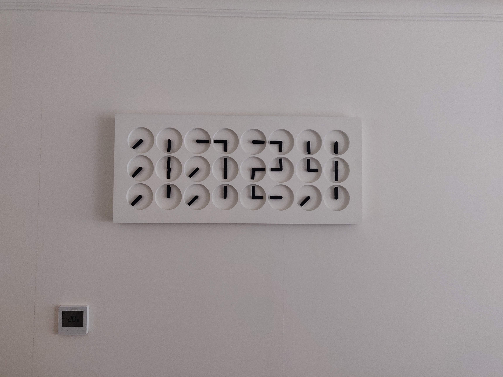
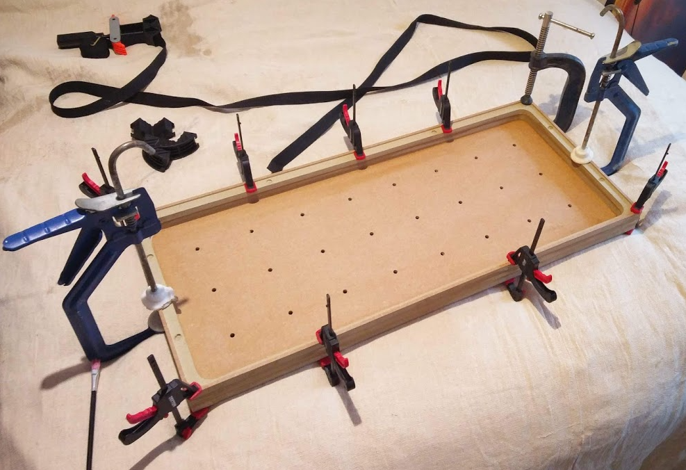
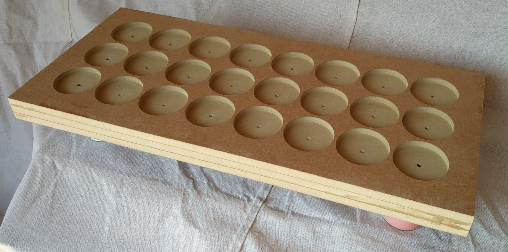
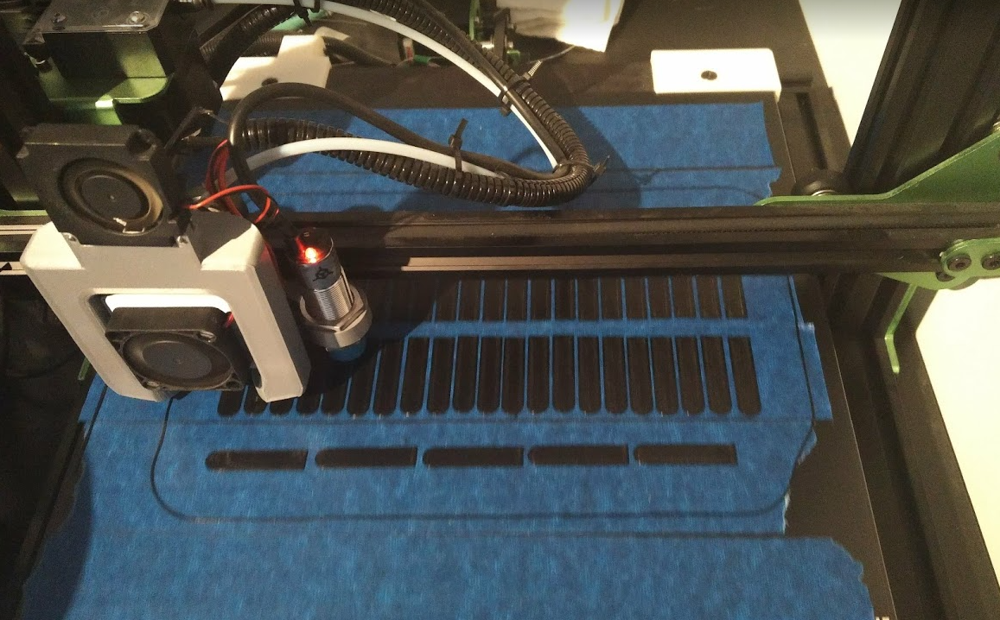
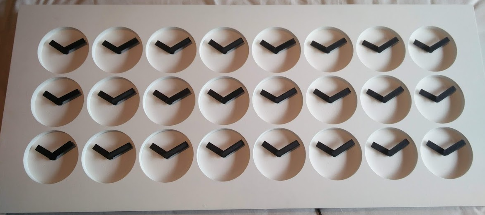

# ClockClock 24 Clone
My attempt to create a copy of the "ClockClock 24" by Humans Since 1982

1. [Background](#background)
1. [Final Replica Spoiler](#final-replica-spoiler)
1. [Design](#design)
	1. [Electronics](#electronics)
	1. [Physical Case/Hands](#physical-casehands)
	1. [Movement Logic](#movement-logic)

## Background
Humans Since 1982 are a Sweden based artist studio, established in 2009 by founding artists Bastian Bischoff and Per Emanuelsson. One of their projects named the "ClockClock" caught my eye as a really interesting way of diplaying the time. It uses an array of analog clock faces to create the same kind of image a 7-segment display would. This array of seperate clock faces can then work together to create patterns as transitions between times.

<p align="center"><em>
	ClockClock showing 09:35, image from the Humans Since 1982 website
</em></p>

<p align="center">
  
</p>
<p align="center"><em>
	ClockClock cycling through times 09:25 to 09:27
</em></p>

It is, however, ludicrously expensive - the artists sell them for €5,400 on their website. The engineer in me figured that it surely wouldn't cost anywhere near that to replicate, and would make a cool project as well. This readme briefly details everything that went into creating a near-perfect replica of this product.


## Final Replica Spoiler
Below is the final product I created

<p align="center">
  
</p>
<p align="center"><em>
	My ClockClock clone cycling through times 09:25 to 09:27
</em></p>

<p align="center">
  
  
  
</p>
<p align="center"><em>
	My ClockClock clone mounted on the wall in my house, 17:23 -> 17:24
</em></p>

Some basic info:
- Dimensions: 750 x 330 x 45mm
- Power requirement: 5V, ~1.5A when all motors spinning full speed
- Parts cost: ~£600 (Total cost incl. R&D  much higher)

## Design

### Electronics

The motion system for 48 individual hands was the most challenging part of this project. The clock needs to be silent and have precise positional control over each hand. The simplest way of achieving this was to use stepper motors. 

I tested a few different options before arriving at using the BKA30D-R5 motor. This is a small concentric dual-shaft stepper motor, so avoids the need for any gearing of 2 seperate motors for each clock face. 

Stepper motors inherently create vibrations through their stepped movement, and so to reduce noise I used a specialised stepper driver IC (the TMC2208) for each hand's motor (i.e. 2 per BKA30D-R5). This smooths out the steps and makes the motor run much quieter. This also handles the control of each motor to the point where I just need to control a step and direction digital pin for each motor. 

Controlling the logic is an Arduino, and to be able to control all 48 step and direction pins (i.e. 96 IOs), I used a chain of shift registers. 

Each clock face's electronics are combined onto standalone PCBs, which daisy chain together. Each edge of the PCB has pins that allow PCBs placed next to each other to connect any needed pin via any edge. Adjacent pins connect to eachother with shunt connectors.

<p align="center">
  
</p>

These PCBs need precise relative placement to allow them to connect with the shunts, and so a 3D-printed jig allows standoffs to hold them in the right place (the case is CNCd as described in [Case/Hands](#physical-casehands))

<p align="center">
  
  
  
</p>

### Physical Case/Hands

The ClockClock 24 has a fairly simple shape, just a solid block with indented clock faces. This can easily be manufactured from MDF with a CNC router, and so after creating a 3D model I had a company cut it for me. It was cheapest to have it done from 3 sheets of thinner MDF and then glue them together. I spray painted it white for the final finish.

<p align="center">
  
  
</p>

The CNC manufature of the case represented a significant cost of this project, and so a follow up project I am working on is to completely 3D print the case, with a design more similar to the ["Clock Clock White"](https://www.humanssince1982.com/the-clock-clock-white) rather than "ClockClock 24".

The hands were 3D-printed from black PLA, which when added to the shafts of the motors give the exact look of the original.

<p align="center">
  
  
</p>


### Movement Logic

The control of each stepper motor's movement is controlled by 2 IOs (step/direction) coming off a chain of shift registers, and so this entire chain needs to be updated to control any individual motor. To move a motor one step, the step pin needs to go high then low, and so the whole chain actually needs updating twice to move one step. 

The most basic transition is the "random" spinning of each hand until it falls into the correct position for the new time, which starts and stops for all motors in unison. This can be simplified by looking at how far each hand needs to move to go from its current positionto the new position. This will handily always be a multiple of eighths of a rotation, since the positions a hand needs to be in to form a number is either straight up/down/to the side, or diagonally down-left. 

The current position and goal position is known for any current time to the next. The number of eigths of a rotation a hand needs to move is used to create a step sequence of X steps, where X is the largest number of eighths that need to be moved. If the shortest possible distances are being used for a given rotation direction, this would be an 8 step sequence (you want hands to always move for a transition and so remaining in the same position gives 1 full rotation - aditional rotations can be specified to extend the animation). If a hand wants to move 3 eighths, it would step 3 times in this X step sequence. 

An 8 step sequence for a motor that wants to move 3 eigths therefore looks like:
> 11100000

This sequence is then repeated by the number of steps in one eighth of a rotation. Since there are thousands of steps in one rotation (5,760 to be exact), this rapid 3 step movement followed by 5 steps of rest is not noticeable, and looks as if it is moving with constant speed.

The loop to move all motors then looks something like:

```c  
for (int x = 0; x < eigthSteps; x++){
  for (int y = 0; y < maxEigths; y++) {

    digitalLow(latchPin);
    for (int i = 0; i < 48; i = i+2) { // for each module
      stepping1 = ((distances[i]/eigthSteps) > y)?(1):(0);
      stepping2 = ((distances[i+1]/eigthSteps) > y)?(1):(0);
      shiftModuleOut(0,0,0,0,directions[i],stepping1,directions[i+1],stepping2); // step highs needed
    }

    digitalHigh(latchPin);
    delayMicroseconds(stepDelay(x));
    digitalLow(latchPin);

    for (int i = 0; i < 48; i = i+2) { // for each module
      shiftModuleOut(0,0,0,0,directions[i],0,directions[i+1],0); // step all low
    }

    digitalHigh(latchPin);
    delayMicroseconds(stepDelay(x));
  }
}
```
  Where:
  - The `shiftModuleOut()` function is specific to the pinouts of the shift register on the PCB
  - The `distances` array stores the number of steps each hand needs to move
  - `maxEigths` is the largest number of eigths that need ot be moved (i.e. 8 for max 1 roation as previously mentioned)
  - The `directions` array stores the direction each hand needs to move, which is set as opposite for each clock face's hands in this animation
  - The `stepDelay()` function calculates a delay between steps based on where in the sequence we are. This is used to give a global acceleration at the start and end of the sequence to make motion smoother

