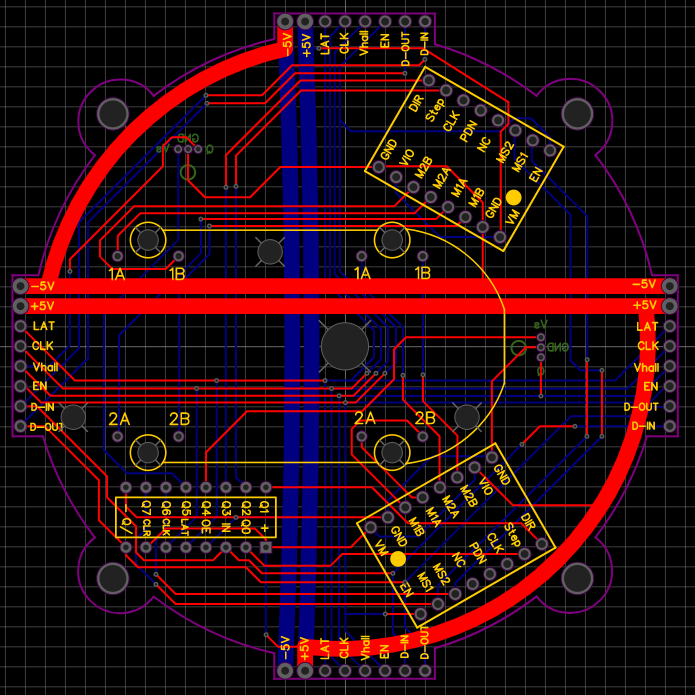
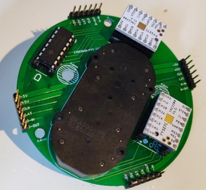
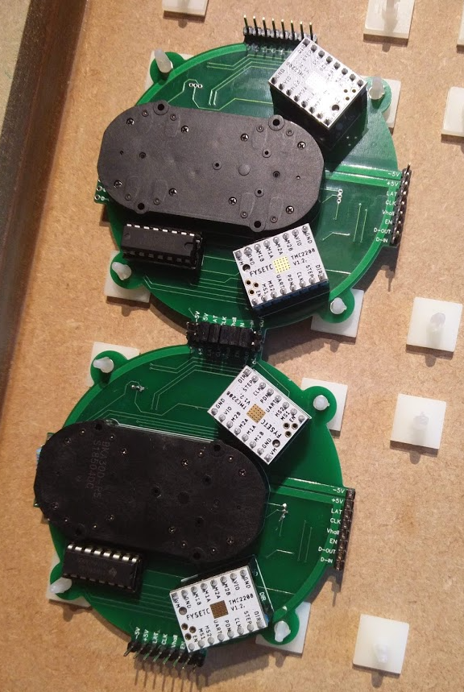
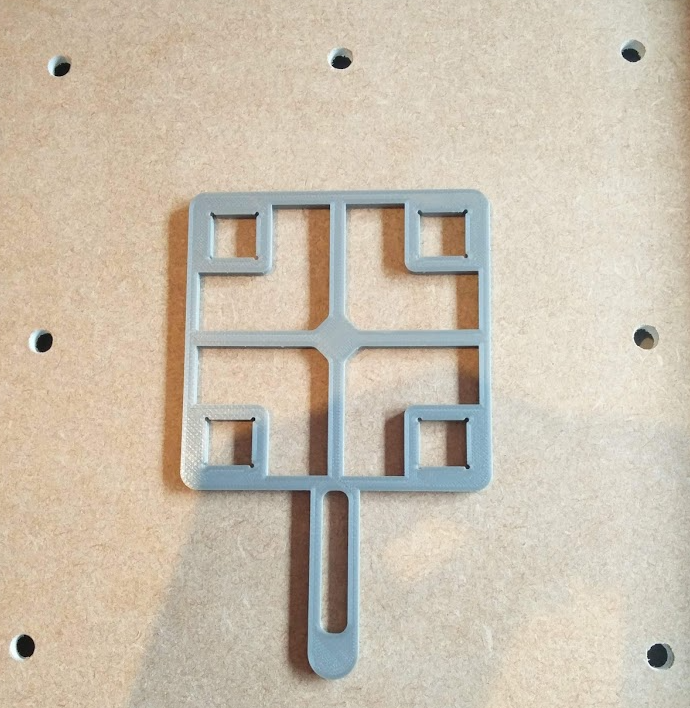
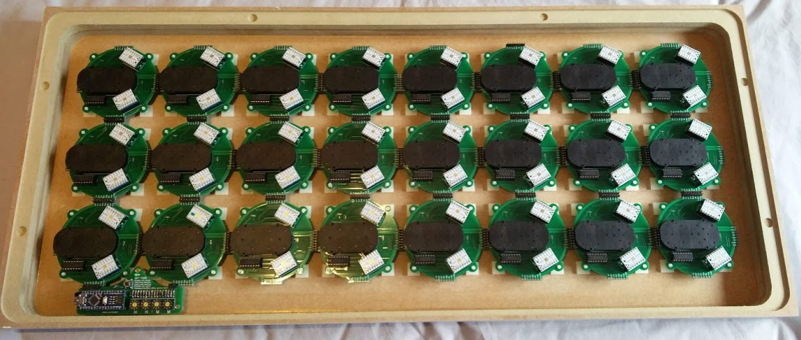

# ClockClock 24 Clone
My attempt to create a copy of the "ClockClock 24" by Humans Since 1982

1. [Background](#background)
1. [Final Replica Spoiler](#final-replica-spoiler)
1. [Design](#design)
	1. [Electronics](#electronics)
	1. [Case/Hands](#physical-casehands)
	1. [Code](#code)

## Background
Humans Since 1982 are a Sweden based artist studio, established in 2009 by founding artists Bastian Bischoff and Per Emanuelsson. One of their projects named the "ClockClock" caught my eye as a really interesting way of diplaying the time. It uses an array of analog clock faces to create the same kind of image a 7-segment display would. This array of seperate clock faces can then work together to create patterns as transitions between times.

<em>
	ClockClock showing 09:35, image from the Humans Since 1982 website
</em>

  

<em>
	ClockClock cycling through times 09:25 to 09:27
</em>

It is, however, ludicrously expensive - the artists sell them for €5,400 on their website. The engineer in me figured that it surely wouldn't cost anywhere near that to replicate, and would make a cool project as well. This repository details everything that went into creating a near-perfect replica of this product.

## Final Replica Spoiler
Below is the final product I created

  

<em>
	My ClockClock clone cycling through times 09:25 to 09:27
</em>

## Design

### Electronics

The motion system for 48 individual hands was the most challenging part of this project. The clock needs to be silent and have precise positional control over each hand. The simplest way of achieving this was to use stepper motors. 

I tested a few different options before arriving at using the BKA30D-R5 motor. This is a small concentric dual-shaft stepper motor, so avoids the need for any gearing of 2 seperate motors for each clock face. 

Stepper motors inherently create vibrations through their stepped movement, and so to reduce noise I used a specialised stepper driver IC (the TMC2208) for each hand's motor (i.e. 2 per BKA30D-R5). This smooths out the steps and makes the motor run much quieter. This also handles the control of each motor to the point where I just need to control a step and direction digital pin for each motor. 

Controlling the logic is an Arduino, and to be able to control all 48 step and direction pins (i.e. 96 IOs), I used a chain of shift registers. 

Each clock face's electronics are combined onto standalone PCBs, which daisy chain together. Each edge of the PCB has pins that allow PCBs placed next to each other to connect any needed pin via any edge. Adjacent pins connect to eachother with shunt connectors.

  
  

These PCBs need precise relative placement to allow them to connect with the shunts, and so a 3D-printed jig allows standoffs to hold them in the right place.

  
  
  

### Physical Case/Hands

### Code

